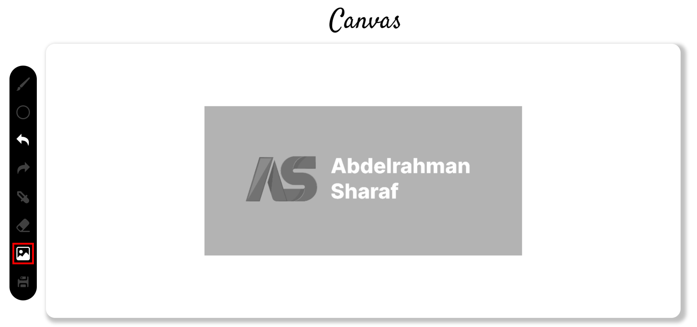
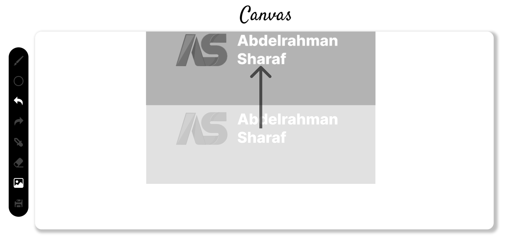
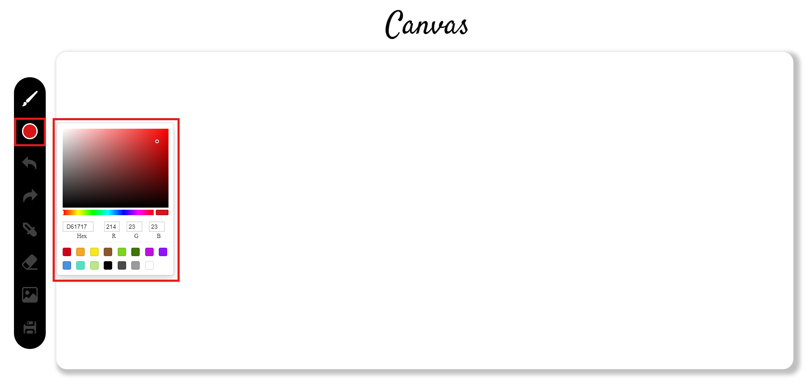
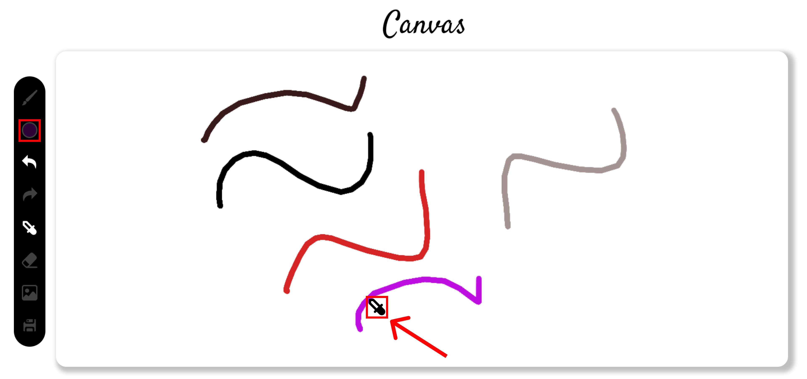
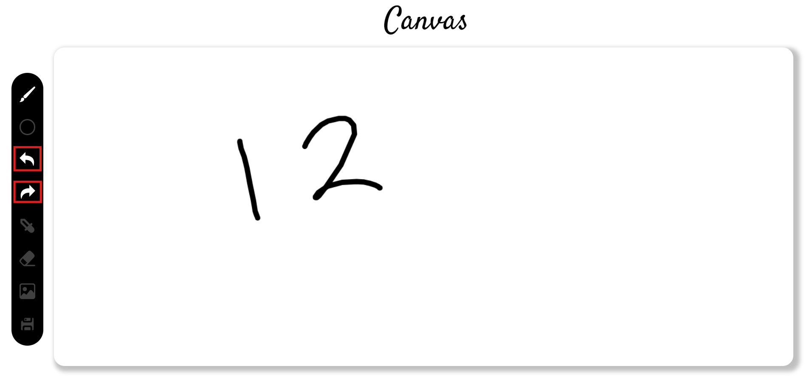
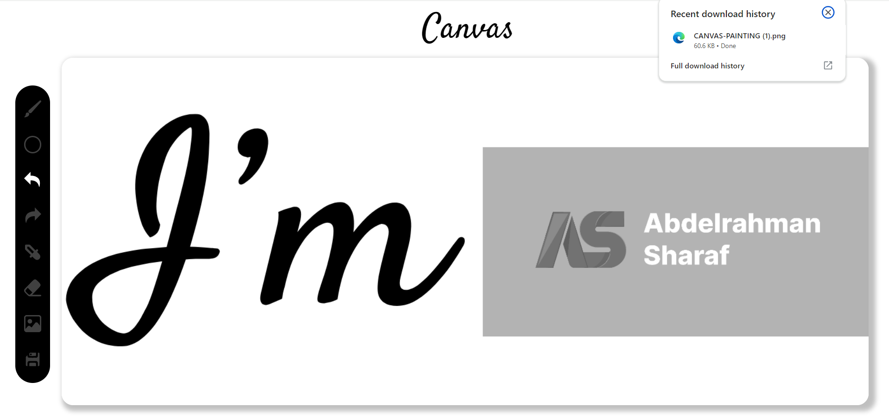

# Painter Web App (Canvas) 🎨

**A feature-rich canvas painting application built with React.**

This web app utilizes React for a dynamic user interface and leverages Figma for prototyping a responsive design that adapts seamlessly across various devices.

## Key Technologies

- ### React

- ### Vite

- ### Canvas API

- ### Figma (for Prototyping)

- ### Git & Github

## Features

- ### Image Uploading

Import your own images and add it to canvas.

- ### Image Manipulation

Easily move and position uploaded images.

- ### Brush Painting

- ### Eraser Tool

- ### Color Picking

Select colors directly from the canvas using the eyedropper tool or leverage the color picker for precise control.

- ### Undo/Redo Functionality

Experiment freely with the ability to undo and redo actions.

- ### Canvas Saving as PNG

Save your finished masterpiece as a PNG file.

## Screenshots

- Responsive Design (Figma Prototype)

- Image Uploading

- Image Moving

- Color Picker Tool

- Eye Dropper Tool

- Undo/Redo Functionality

- Canvas Saving as PNG

This Painter Web App effectively showcases my capabilities in building dynamic and interactive web applications using React and modern web technologies.
