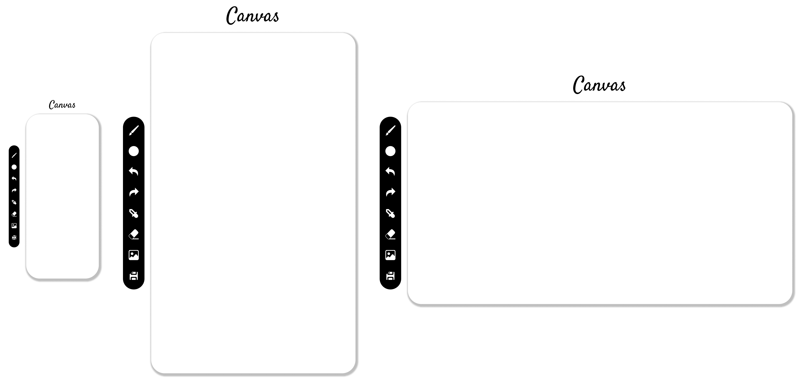
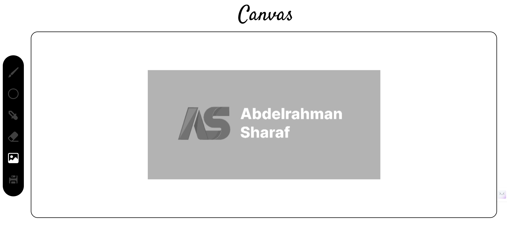
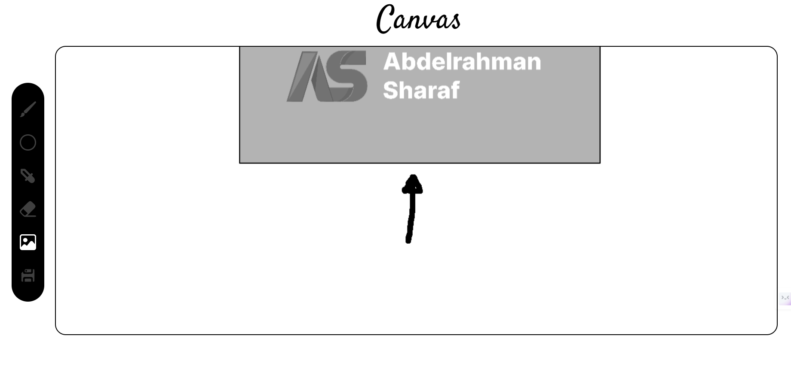
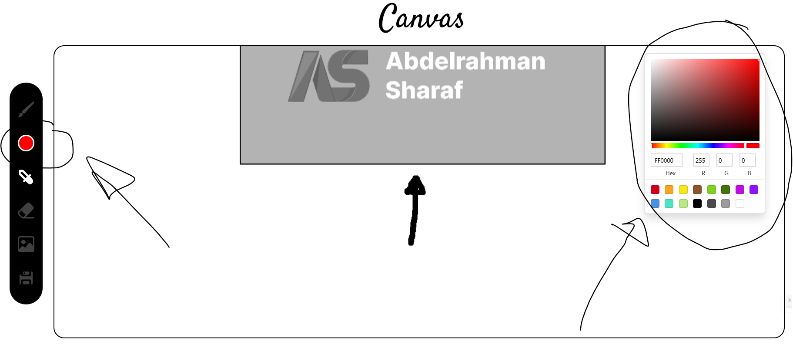

# Painter Web App (Canvas) 🎨

- ## responsive design prototyped using figma
  

- ## made functionality using react

- ## image uploading  
  

- ## image moving  

- ## canvas saving as png file with transparent background

- ## drawing using brush  

- ## picking color from the canvas using eyedropper

- ## selecting color using color-picker-tool

- ## erasing the canvas (not adding white-color) download it to check
